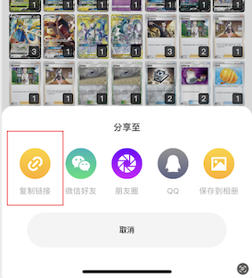
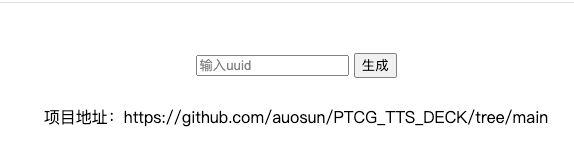
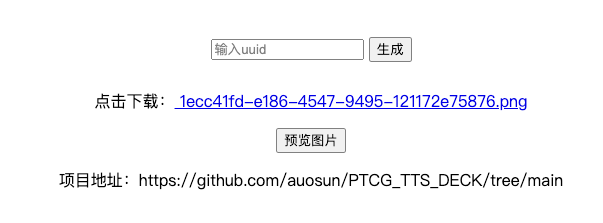
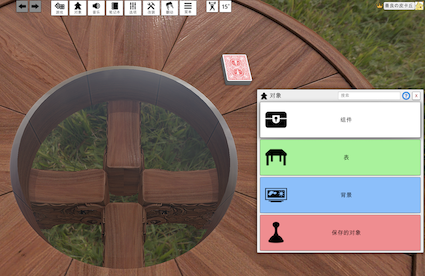
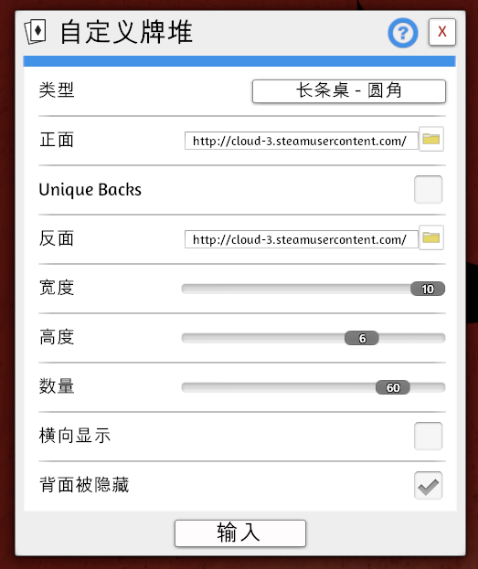
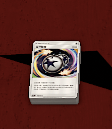

# PTCG_TTS_DECK

[体验地址](https://ptcgttsdeck--jzysuzhou.repl.co/) 

## 卡组uuid

疾患社APP复制卡组链接



```
https://...marketDeckUuid=1ecc41fd-e186-4547-9495-121172e75876&gameKey=pkm&language=sc
```

提取链接`marketDeckUuid=`后面，`&gameKey`之前的部分也就是 `1ecc41fd-e186-4547-9495-121172e75876`

## 牌堆卡图

打开[体验地址](https://ptcgttsdeck--jzysuzhou.repl.co/) 



将uuid复制到输入框，点击生成，手动刷新平台。



生成完毕如上图所示，如未完成，平台会返回当前生成状态，请耐心等待。

预览加载时间较长，可直接点击链接下载。

## TTS牌堆

进入打牌MOD，点击上方 `物体` -> `组件` -> `卡牌` -> `自定义牌堆` 



右键生成的牌堆，填入参数



参数如图所示，正面使用获取到牌堆卡图，反面可以自己找一张，[卡牌背面](static/img/reverse_card.jpg)



等待加载完成则如上图所示，愉快的打牌吧，enjoy～

## 感谢

1. [TTS卡图导入](https://www.bilibili.com/video/BV1cL4y1M7YE/?spm_id_from=333.880.my_history.page.click&vd_source=a09813c441d8c38191c5ae13876a8772)

2. [PTCG打牌MOD](https://steamcommunity.com/sharedfiles/filedetails/?id=2899827555)
