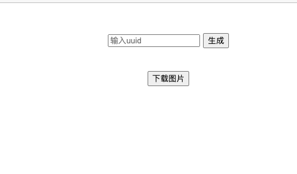
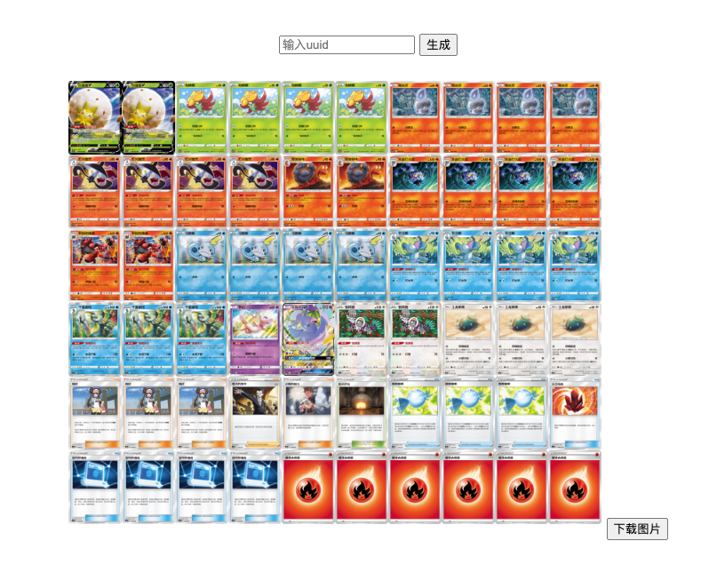

# PTCG_TTS_DECK

[体验地址](https://ptcgttsdeck--jzysuzhou.repl.co/) 

## 获取卡组uuid

从疾患社APP分享卡组至微信，并在浏览器打开

复制红色选框内容

## 制作TTS牌堆

打开体验地址

将uuid复制到输入框，点击生成，手动刷新页面查看服务器返回状态，或者关闭浏览器等一会儿再来。
输入同样的uuid查看图片，如图片正常加载。如下所示。体验地址体验较差，有能力者推荐本地部署。

图片另存为或点击下载图片即可

